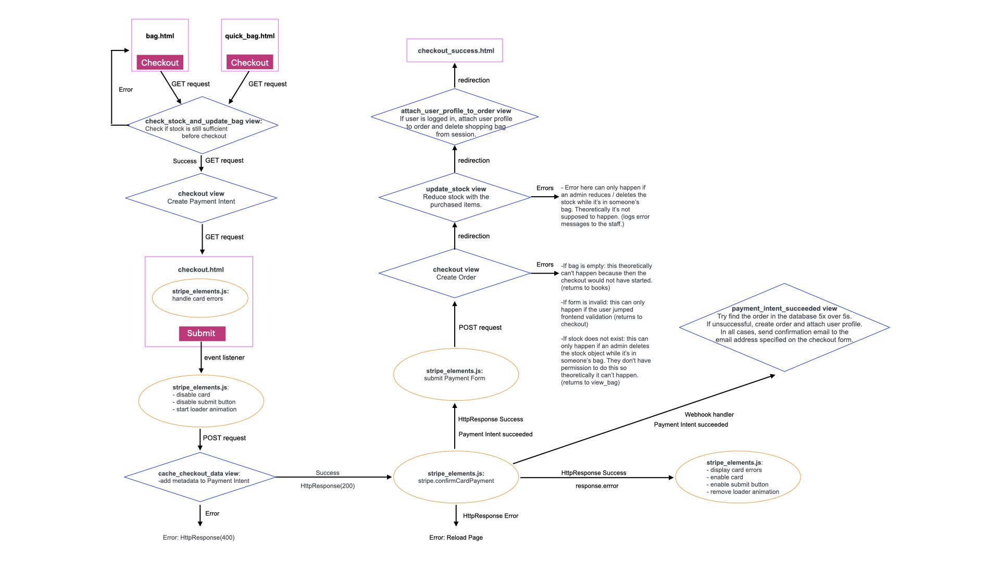

# Book-CYCLE

Book-CYCLE is a Full Stack Webshop Application designed to be used by secondary schools in the UK. The purpose of the site is to promote re-use of textbooks by students while generating income for the school. The webshop allows the school to list all the textbooks they recommend their students to buy in both new and used conditions - possibly asking students to donate their used books back to the school. 

Users can puchase listed textbooks using the STRIPE payment system, receiving confirmation emails about orders and shipping. School staff members can manage the book inventory and incoming orders.

The webshop has not been customized to a specific school, which could be done by including the school's logo, contact details, and possibly some additional design elements. Customisations would allow the webshop to be utilized by multiple schools.

The project is written in Django, a full-stack python framework alongside HTML, CSS and JavaScript. The Stripe API is used for payments.

---
### [View the live project here.](https://book-cycle-f6aff45df7ba.herokuapp.com/inventory/books/)

---

Not for public use.
    
&copy; 2023 Szilvia Csernusne Berczes. All rights reserved.

---

# User Stories

---
# Data

Database Schema in Lucid Charts:

https://lucid.app/lucidchart/8eb93ba8-43af-4939-9709-11dcc52da382/edit?viewport_loc=-452%2C117%2C2818%2C1215%2C0_0&invitationId=inv_a84acf43-e6e9-4d82-b0e2-672a16e53969

---

# Features

## Checkout

# SEO

* Lighthouse scores for Search Engine Optimasation are 100% throughout all pages.

* Furthermore, I created a `slug` for each book, based on their titles, that makes the book discoverable by search engines when someone is searching for the book's title. This approach will increase the site's traffic and increases potential revenue.

# Credits

## Programs used

* Image converter: https://cloudconvert.com/jpg-to-webp
* File converter (csv to json): https://csvjson.com/csv2json
* Favicon generator: https://realfavicongenerator.net/

## Learning Resources

* Hello Django walkthrough project by Code Institute
* Boutique Ado walkthrough project by Code Institute
* Django documentation
* Django-allauth documentation
* Crispy forms documentation
* Webinar by Matt Rudge (Code Institute) https://www.youtube.com/watch?app=desktop&si=7Y-7qKnSZBRNzIxG&v=YH--VobIA8c&feature=youtu.be

## Helpful ideas

* Converting images to 'webp' format in python: https://www.webucator.com/tutorial/using-python-to-convert-images-to-webp/

* Colorizing automated django testing outputs: https://stackoverflow.com/questions/7815513/colorizing-the-output-of-django-tests

* Why django test files' imports can fail: https://stackoverflow.com/questions/51676483/importerror-failed-to-import-test-module

* How to use 'crispy_forms' without Bootstrap: https://levelup.gitconnected.com/how-to-make-your-django-forms-look-crispy-78a68000bc3f

* How to access request.POST data sent using fetch request:
https://stackoverflow.com/questions/61543829/django-taking-values-from-post-request-javascript-fetch-api

* Django Allauth documentation:
https://django-allauth.readthedocs.io/en/latest/account/configuration.html

* Django Crispy Forms documentation
https://django-crispy-forms.readthedocs.io/en/latest/index.html

## Images

* Background image: https://unsplash.com/photos/OQSCtabGkSY - Photo by [Jessica Ruscello]("https://unsplash.com/@jruscello?utm_source=unsplash&utm_medium=referral&utm_content=creditCopyText") on [Unsplash]("https://unsplash.com/photos/OQSCtabGkSY?utm_source=unsplash&utm_medium=referral&utm_content=creditCopyText")

* Google logo: Vectors and icons by <a href="https://design.google/?ref=svgrepo.com" target="_blank">Google Design</a> in Logo License via <a href="https://www.svgrepo.com/" target="_blank">SVG Repo</a>

* Exemption from Copyright law: https://www.gov.uk/guidance/exceptions-to-copyright#non-commercial-research-and-private-study
  