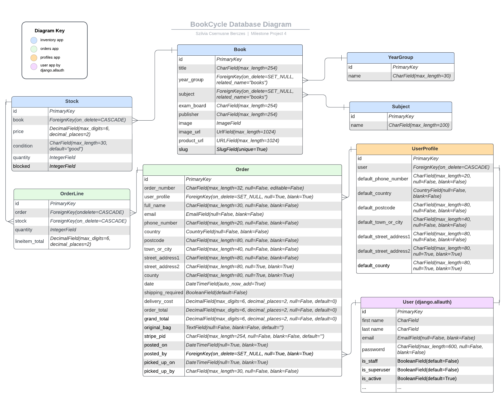

# bookCYCLE

---
### [view the live project here](https://book-cycle-f6aff45df7ba.herokuapp.com/inventory/books/)

---

# User Stories

# Data

Database Schema in Lucid Charts:

https://lucid.app/lucidchart/8eb93ba8-43af-4939-9709-11dcc52da382/edit?viewport_loc=-452%2C117%2C2818%2C1215%2C0_0&invitationId=inv_a84acf43-e6e9-4d82-b0e2-672a16e53969

# SEO

* Lighthouse scores for Search Engine Optimasation are 100% throughout all pages.

* Furthermore, I created a `slug` for each book, based on their titles, that makes the book discoverable by search engines when someone is searching for the book's title. This approach will increase the site's traffic and increases potential revenue.

# Credits

## Programs used

* Image converter: https://cloudconvert.com/jpg-to-webp
* File converter (csv to json): https://csvjson.com/csv2json

## Helpful ideas

* Converting images to 'webp' format in python: https://www.webucator.com/tutorial/using-python-to-convert-images-to-webp/

* Colorizing automated django testing outputs: https://stackoverflow.com/questions/7815513/colorizing-the-output-of-django-tests

* Why django test files' imports can fail: https://stackoverflow.com/questions/51676483/importerror-failed-to-import-test-module

* How to use 'crispy_forms' without Bootstrap: https://levelup.gitconnected.com/how-to-make-your-django-forms-look-crispy-78a68000bc3f

* How to access request.POST data sent using fetch request:
https://stackoverflow.com/questions/61543829/django-taking-values-from-post-request-javascript-fetch-api

## Images

* Background image: https://unsplash.com/photos/OQSCtabGkSY - Photo by [Jessica Ruscello]("https://unsplash.com/@jruscello?utm_source=unsplash&utm_medium=referral&utm_content=creditCopyText") on [Unsplash]("https://unsplash.com/photos/OQSCtabGkSY?utm_source=unsplash&utm_medium=referral&utm_content=creditCopyText")

* Exemption from Copyright law: https://www.gov.uk/guidance/exceptions-to-copyright#non-commercial-research-and-private-study
  