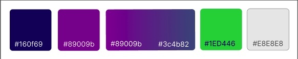
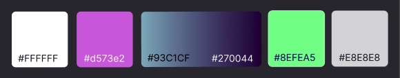
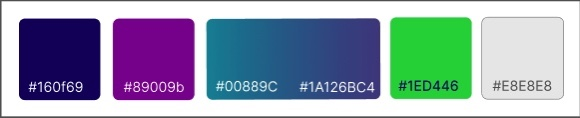
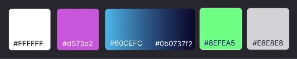
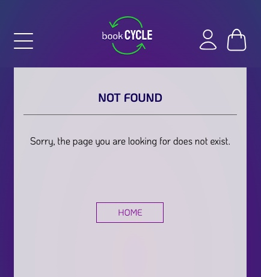
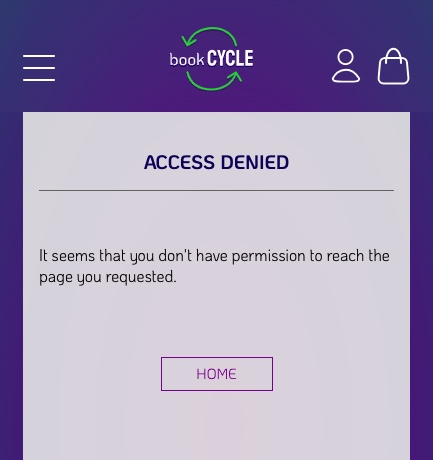
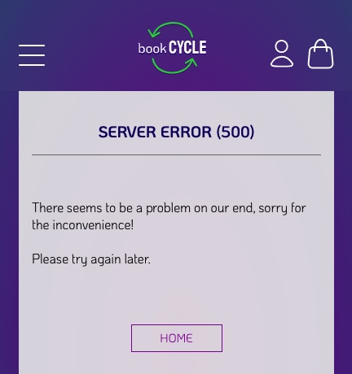

# Book-CYCLE

Book-CYCLE is a Full Stack Webshop Application designed to be used by secondary schools in the UK. The purpose of the site is to promote re-use of textbooks by students while generating income for the school. The webshop allows the school to list all the textbooks they recommend their students to buy in both new and used conditions - possibly asking students to donate their used books back to the school. 

Users can puchase listed textbooks using the STRIPE payment system, receiving confirmation emails about orders and shipping. School staff members can manage the book inventory and incoming orders.

The webshop has not been customized to a specific school, which could be done by including the school's logo, contact details, and possibly some additional design elements. Customisations would allow the webshop to be utilized by multiple schools.

The project is written in Django, a full-stack python framework, alongside HTML, CSS and JavaScript. The Stripe API is used for payments.

---
[View the live project here](https://book-cycle-f6aff45df7ba.herokuapp.com/inventory/books/)
---


> This project was created for [Code Institute](www.codeintitute.net)'s Web Development Course as the Fourth Milestone Project (MS4) - Full Stack E-Commerce Web Application.

Not for public use.
    
&copy; 2023 Szilvia Csernusne Berczes.

---

# User Experience (UX)

## User Stories


---
## Wireframes

Wireframes were created in [Balsamiq](https://balsamiq.cloud/).   

  
  
 

---

## Colour Scheme

I chose the colours myself, colour palette was created using [Figma](https://www.figma.com/).

|Book store - light mode| Book store - dark mode |
|:---:|:---:|
|||
|Admin Console - light mode| Admin Console - dark mode |
|||

---

## Typography

I used two fonts, [Koulen](https://fonts.google.com/specimen/Koulen) and [KoHo](https://fonts.google.com/specimen/KoHo) from the [Google Fonts](https://fonts.google.com/) library. I selected them because I felt that they complement each other and their styles are fitting the theme.

---

## Imagery

The [main image](https://unsplash.com/photos/OQSCtabGkSY) on the home page is created by [Jessica Ruscello]("https://unsplash.com/@jruscello?utm_source=unsplash&utm_medium=referral&utm_content=creditCopyText"), distributed by [Unsplash]("https://unsplash.com/photos/OQSCtabGkSY?utm_source=unsplash&utm_medium=referral&utm_content=creditCopyText").

The logo and icons are my own drawings, with the exception of the [Google icon](https://design.google/?ref=svgrepo.com), which was downloaded from [SVG Repo](https://www.svgrepo.com/).

---

# Data

## Database Schema

The diagram shows a layout of the tables represented by my models in the database. The tables that were created by  django by default are omitted, as well as the `django-allauth` tables, with the exeption of the `User` table which is directly connected to my `User Profile` and `Order` tables.


[Lucid Charts](https://lucid.app/) was used to visualize the database schema.


[Schema Link (accessible for LucidChart users)](https://lucid.app/lucidchart/8eb93ba8-43af-4939-9709-11dcc52da382/edit?viewport_loc=-452%2C117%2C2818%2C1215%2C0_0&invitationId=inv_a84acf43-e6e9-4d82-b0e2-672a16e53969)

## Product data

I compiled a custom textbook list, converted it to json and wrote custom scripts to create stock data - generating prices and stock amounts randomly. Finally, I used these files as `fixtures` to populate the database.

The book pictures and details were taken from the publishers websites, a link pointing to the original site is provided for all books.

---

# Features

## Landing Page

The Landing page is minimalist with only few options on the top. The side menu opens from the left hand side, where users can search for textbooks in the store.

|Landing Page - light mode |Side Menu|Landing Page on mobile|
|:---:|:---:|:---:|
||||
|Landing Page - dark mode |||
||||
---

## Bookstore

### Filtering for books

The user has filtering and searching options from the side menu and additional options in the main bookstore page.
Clicking the `shop` button or one of the filtering options from the menu, we will be taken to the bookstore:
|Book store - light mode| Book store - dark mode |
|:---:|:---:|
|||
| <td colspan="2">Under the `More Options` button, complex searching, filtering and sorting can be carried out.
|||

In order to speed up loading, pagination is used to avoid unneccessary data load.

---

## Shopping Process

We can start shopping right away, without the need for signing up.
We can add products directly from the bookstore's page or by visiting the individual book's page.


Stock management allows to display the available stock to the user and prevent purchasing out-of-stock items.

|Book Detail Page - light mode|Book Detail Page - dark mode|
|:---:|:---:|
|||

---

The shopping bag is available by clicking the shopping bag icon in the top right corner of the page.
|Shopping bag from side - light mode|Shopping bag from side - dark mode|
|:---:|:---:|
|||

---

If we would like to edit our shopping bag, we can do so by clicking the `Edit Bag` button. We can also select our shipping preference. 
|Shopping bag - light mode|Shopping bag - dark mode|
|:---:|:---:|
|||

---

If we choose to go back to the bookstore's page, we will see if we have a particular book in our shopping bag:


---

After clicking the `Checkout` button, we will be taken to the `Checkout Page`. If we chose to have the books delivered, we need to give detailed shipping information. Otherwise, only the `Country` and the `Postcode` are needed for the card payment.
|Checkout - light mode|Checkout - dark mode|
|:---:|:---:|
|||

---

`Stripe` provides a number of test cards that we can use for successful / failed payments. After a successful payment, we will receive a confirmation email about our order.
|Payment|Checkout Success Page & Email Confirmation|
|:---:|:---:|
| ||

---

## Authentication

I used the `django-allauth` package to implement authentication. The user can sign up with email address & password, as well their `Google account`.

### Register with email

Signing Up with email and password is straightforward. After the user clicks the link in the verification email, they will get signed in straight away.
|Register|Verify Email Page|Verify Email Message|
|:---:|:---:|:---:|
||||

---
### Sign in

For signing in at a later time, the user's email and password are required.

|Sign In Page|Sign In Success|
|:---:|:---:|
|||

---
### Registering/Signing in with a Google account

If a user sings in with their Google account, there is no need to verify the email address so the process is significantly faster. In the admin views below, I demonstrate how my user account and social account was created when I signed up with my Google account. In this case, no Password has been set.

|Google Sign In |User's account in Admin view|
|:---:|:---:|
|||

---

If a user already has an account and later decides to use their social account, their social account will be linked to their original account if the email address is the same.

---
### User Account

After successful registration, the user has access to their `order history` and `contact details`. 
|User Account Page light mode|User account Page dark mode|
|:---:|:---:|
|||

---

The user can `change` their password if they have one or `set` a new password if they don't. 
|Change Password |User with Social Account Only |Set Password|
|:---:|:---:|:---:|
||||

---

All users can use the `Forgot password?` function.
|Password Reset | Password Reset Notification |
|:---:|:---:|
|||

---
### Deleting a User Account

The user can delete their account from the database, including their social account. Their order history will not be erased from the database, but no profile info will have been attached to them and will be inaccessible for the user.
I demonstrate how a user account is being deleted by deleting my social account I created earlier.
| Confirm Notification |Account Deleted Message |Accound Deleted Admin View|
|:---:|:---:|:---:|
||||


## Admin Functions

If the user's account is a `Staff Account`, they are taken to a different home page after signing in.
|Admin Home light mode|Side Menu|
|:---:|:---:|
|||
|Admin Home dark mode|Side Menu|
|||


---

## Inventory Management

Staff members can Add/Edit/Delete Books as well as manage the books' stock.

|Add New Book | Add New Book Success |
|:---:|:---:|
|||
|Manage Stock ||
|||
|Edit Book | Edit Book Success |
|||
|Delete Book | Delete Book Success |
|||

---

## Order Management

Staff members can monitor if there are new orders in the system. The orders which require shipping are listed separately from the ones that need to be collected.
|Orders require shipping | Orders for Collection |
|:---:|:---:|
|||

---

On the individual order's page, the staff member can use the shipping details for postage and register the tracking number.
|Order to Post (light mode) |Successful shipping|
|:---:|:---:|
|||

---

Similarly to the shipping, the staff member can register if an order has been collected.
|Order for Collection (dark mode) |Successful Collection|
|:---:|:---:|
|||

## Error pages

In case of an error, custom error pages would be shown to the user.
* `404 (not found) page` in case of an invalid URL was typed in,
* `403 (access denied) page` if there is an authentication issue,
* `400 (bad request)` if a request to the server was sent with incorrect data/sturcture,
* `500 (internal server error)` in case there is a problem with code execution or with the connection to the server. 
  
|404 - Not Found | 403 - Access Denied | 500 = Server Error |
|:---:|:---:|:---:|
||||

    
 ---

# Accessibility
  

* Semantic HTML was used.
* Images have `alt` labels. 
* Icons which have inferred meanings are marked with `aria` labels.
* All colours were tested for contrast in Chrome's Dev Tools.
* For detailed Lighthouse scores for Accessibility, please refer to the [Testing document](TESTING.md#lighthouse-tests).

--- 


# SEO

* Lighthouse scores for Search Engine Optimasation are 100% throughout all pages.

* `robots.txt` and `sitemap.xml` are provided to be used by search engines.

* I created a `slug` for each book, based on their titles, that makes the book discoverable by search engines when someone is searching for the book's title. This approach will increase the site's traffic and increases potential revenue.

---

# Performance

In order to achieve the best possible performance, I chose not to use any frontend libraries that have to load before the page renders (like Bootstrap / Materialize or JQuery) to reduce render blocking code loading. While writing the code this way was more complex, it greatly improved the project's Lighthouse scores. In local development, all my Performance scores are over 90%. The lower performance in production are all down to unavoidable elements, like Stripe's script needed for Fraud detection and the slow response time from the hosting providers - purchasing more expensive hosting packages would greatly improve performance in production. 

To further improve the site's responsiveness and achieve seamless user experience, a frontend framework like ReactJS could be used combined with Django's REST framework for the backend. This architecture however, was beyond the scope of this project.

For the project's detailed Lighthouse scores, please refer to the [Testing document](TESTING.md#lighthouse-tests).

---

## Future Implementations

* Further functions for staff members - searching/filtering orders, handling returns and refunds.

* Implementing an API to calculate postage data and integrate package tracking.

* Re-creating the project in a Django REST + ReactJS architecture to improve user experience.


---

# Technologies Used
  

## Languages Used
  

* Python
    - Using the Django framework and other plugins to develop the app.
* HTML
    - For page structure.
* CSS
    - For styling.
* Javascript
    - Interactive frontend components and AJAX.
  

## Frameworks, Libraries and Packages
  

* [Django](https://www.djangoproject.com/) - Fullstack python framework

* [Stripe](https://stripe.com/gb) - Used for processing payments securely.

* [django-allauth](https://allauth.org/) - A Django package for authentication

* [crispy-forms](https://django-crispy-forms.readthedocs.io/en/latest/) - A Django package for form management

* [Pillow](https://pypi.org/project/Pillow/) - A python imaging library for processing images

* `boto3` - Used for configuration and Management of AWS

* `coverage` - Measures lines of code tested.

* `dj-database-url` - Parses databse URLs for django.

* `django-countries` - Provides model fields for up-to-date country selection.

* `django-storages` - Creates custom storages for use with AWS.

* `gunicorn` - Web server to run on heroku.

* `psycopg2` - Adapter for use with a Postrgres Database.


## Hosting platforms

* `Heroku` - for hosting main codebase.

* `ElephantSQL` - for database hosting.

* `Amazon AWS S3` - for static/media file hosting. 


## Other Tools

* [Google Fonts](https://fonts.google.com/)  - for texts.

* [Balsamiq](https://balsamiq.cloud/)  - to create wireframes.

* [Figma](https://www.figma.com/)  - to draw the logo and the icons, and to create colour palette.

* [RealFaviconGenerator](https://realfavicongenerator.net/svg-favicon/)  - to generate favicons.

* [Multi Device Website Mockup](https://techsini.com/multi-mockup/index.php)  - to create site visuals for responsive design.

* [VSCode](https://code.visualstudio.com/) - for local development.

* [Git](https://git-scm.com/) & [Github](https://github.com/)  - for version control, safe storage and deployment.

* [Google Dev Tools](https://developer.chrome.com/docs/devtools/)  - for testing and troubleshooting.

* [Lucid App](https://lucid.app) - for database model visuals.

* [Random Key Generator](https://randomkeygen.com/) - to generate a secret key.


---


# Testing

Please refer to [TESTING.md](TESTING.md) for detailed testing documentation.

---
    

# Local Development and Deployment

## Local Development

To develop this project locally in VSCode, the followings steps are needed.    

0. Prerequisites: make sure python and psql are installed.
1. Set up a free account with STRIPE.
2. Clone this project into a new repository.
3. Create a new virtual environment in the project's parent folder with `python3 -m venv venv`.
4. While in the project's parent folder, activate the virtual environment with `source venv/bin/activate`.
5. Reload VSCode window. If the virtual environment creation and activation was successful, `(venv)` will appear in front of the prompt.
6. Install the required packages with `pip install -r requirements.txt`.
7. Create a `.gitignore` file, and place in the lines below.

    ```
    .vscode
    venv
    *.sqlite3
    *.pyc
    __pycache__
    .env
    ```

8. Create the `.env` file.
    
    ```
    SECRET_KEY=<your-secret-key>
    DEVELOPMENT=development
    STRIPE_PUBLIC_KEY=<your-stripe-public-key>
    STRIPE_SECRET_KEY=<your-stripe-secret-key>
    STRIPE_WH_SECRET=<your-stripe-webhook-secret>
    GOOGLE_CLIENT_ID=<your-google-client-id>
    GOOGLE_SECRET=<your-google-secret>
    DEBUG=anything
    ```
9. Run migrations with `python manage.py migrate`

10. Create a superuser for your database with `python manage.py createsuperuser`

11. Populate the database with data (in this order):
    1. `python manage.py loaddata yeargroup`
    2. `python manage.py loaddata subject`
    3. `python manage.py loaddata book`
    4. `python manage.py loaddata stock`

12. To back up data:
    1. `python manage.py dumpdata inventory.YearGroup > backup-yeargroup.json`
    2. `python manage.py dumpdata inventory.Subject > backup-subject.json`
    3. `python manage.py dumpdata inventory.Book > backup-book.json`
    4. `python manage.py dumpdata inventory.Stock > backup-stock.json`

    Alternatively, you can create just one backup file with `python manage.py dumpdata > backup.json`,
    these will include all data inc. user login history.

---

## Deployment

The project is deployed on `Heroku`, the database on `ElephantSQL` and the static/media files on `Amazon AWS S3`.

For deployment, the following steps were taken:

0. Prerequisites: An account with Heroku, ElephantSQL, Amazon AWS, Stripe, and an email server provider, such as Google.
1. Create a new ElephantSQL instance
2. Migrate the database
    * install `dj_database_url` and `psycopg2`,
    * in settings.py, add
    ```python
    import dj_database_url

    if 'DATABASE_URL' in os.environ:
        DATABASES = {
            'default': dj_database_url.parse(os.environ.get('DATABASE_URL', ''))
        }
        else:
            DATABASES = {
                'default': {
                    'ENGINE': 'django.db.backends.sqlite3',
                    'NAME': BASE_DIR / 'db.sqlite3',
                }
            }
    ```
    * temporarily, add `DATABASE_URL=<the-elephant-sql-database-url` to the `.env` file,
    * run `python manage.py showmigrations`, this will show if we are connected to the external database. No checks should show!
    * run `python manage.py migrate`
    * create a superuser for the database with `python manage.py createsuperuser`
    * populate the database with data (in this order):
        1. `python manage.py loaddata yeargroup`
        2. `python manage.py loaddata subject`
        3. `python manage.py loaddata book`
        4. `python manage.py loaddata stock`
    * confirm that the data is in the external database by running a table query in the ElephantSQL/Browser console.
    * remove the temporarily added `DATABASE_URL` from the `.env` file
    * to prevent 500 error on the deployed sign-in, edit the line temporary in the `settings.py`: ACCOUNT_EMAIL_VERIFICATION='none'

3. Create a new `Heroku App`.
    * In Settings/Config Vars add:

        ```
        DATABASE_URL
        SECRET_KEY
        STRIPE_PUBLIC_KEY
        STRIPE_SECRET_KEY
        STRIPE_WH_SECRET
        GOOGLE_CLIENT_ID
        GOOGLE_SECRET 
        EMAIL_HOST_PASS
        EMAIL_HOST_USER
        USE_AWS
        AWS_ACCESS_KEY_ID
        AWS_SECRET_ACCESS_KEY
        ```
    * install `gunicorn`
    * create the `Procfile`
    * to stop Heroku to collect static files, set `DISABLE_COLLECTSATIC` in the config file:
    ```
    heroku login
    heroku config:set DISABLE_COLLECTSTATIC=1 --app <heroku-app-name>
    ```
    * add the new Heroku app url to `ALLOWED_HOSTS` in `settings.py`
    * commit and push changes to Github.
    * set up heroku as a remote heroku repo for the project: `heroku git:remote -a <github-repo-name>`
    * deploy the project: `git push heroku main`
    * set up automatic deployment on Heroku: Deploy/GitHub, search for `<github-repo-name>`, `Connect` then `Enable Automatic Deploys`
3. Create a new `S3` bucket on `Amazon AWS` to serve static and media files
    * Create a new bucket
    * Enable static website hosting in Properties, this will give access point to be uset from the internet.
    Select `Use this bucket to host a website`, keep the default values (they won't be used) and Save Changes.
    * Set up permissions by generating a CORS policy with the Policy Generator.
4. Set up a user group in `AWS IAM` in order to set up user permissions for the new bucket.
    * Create a user group: create a policy by importing `Amazon S3 Full Access`, set it up with the bucket's ARN, attach the policy to the group.
    * Create a user to go in the new group and create access key for this user
    * Add all AWS keys to the Heroku Config Vars.
5. Connect the django project to the new bucket
    * install `boto3` and `django-storages`, add `storages` to INSTALLED_APPS in `settings.py`
    * update the settings to use `AWS`:
    ```python
    if 'USE_AWS' in os.environ:
        # Cache control
        AWS_S3_OBJECT_PARAMETERS = {
            'Expires': 'Thu, 31 Dec 2099 20:00:00 GMT',
            'CacheControl': 'max-age=94608000',
            }

        AWS_STORAGE_BUCKET_NAME = 'book-cycle'
        AWS_S3_REGION_NAME = 'eu-west-2'
        AWS_ACCESS_KEY_ID = os.environ.get('AWS_ACCESS_KEY_ID')
        AWS_SECRET_ACCESS_KEY = os.environ.get('AWS_SECRET_ACCESS_KEY')
        AWS_S3_CUSTOM_DOMAIN = f'{AWS_STORAGE_BUCKET_NAME}.s3.amazonaws.com'

        # Static and media files
        STATICFILES_STORAGE = 'custom_storages.StaticStorage'
        STATICFILES_LOCATION = 'static'
        DEFAULT_FILE_STORAGE = 'custom_storages.MediaStorage'
        MEDIAFILES_LOCATION = 'media'

        # Override static and media URLs in production
        STATIC_URL = f'https://{AWS_S3_CUSTOM_DOMAIN}/{STATICFILES_LOCATION}/'
        MEDIA_URL = f'https://{AWS_S3_CUSTOM_DOMAIN}/{MEDIAFILES_LOCATION}/'
    ```
    * Remove `DISABLE_COLLECTSTATIC=1` variable from the Heroku config vars, because this time, we want django to collect the static files.
    * Create the `custom_storages.py` file to tell django to use `AWS S3` whenever someone runs collectstatic, and when any product image upload occurs.
    * Add and commit all changes to GitHub, which will trigger tha automatic deployment to Heroku. Go to Heroku's Activity tab and view the build log to see if it was successful.
    * Go to `AWS S3`, the new bucket has a `static` folder init.
    * For media files, add a new folder called `media` next to `static`. Click `Upload` and select all images to upload. Click `Upload`.
6. Create/confirm the email address for the superuser.
    * Log in to the admin panel, go to `Email addresses`. Add a new email address if there is none.
    * Go to `Users`, select the only user, add the only email address then merk it as verified and primary.
    * In `settings.py`, change the `ACCOUNT_EMAIL_VERIFIED` back to `mandatory`.
    * Commit and push to GitHub.
7. Set up `STRIPE` for the deployed site.
    * Go to STRIPE `Developers` tag, grap the `API Keys` and add them to Heroku Config.
    * Create a new webhook endpoint with the deployed url, `/checkout/wh/` at the end. Select all events and `Add` them. Scroll down and `Add endppoint`.
    * Reveal the `Signing secret` and add it to the Heroku config vars.
    * Test that the webhook listeners are working by [sending test webhook events from the CLI](TESTING.md#testing-webhooks).
    


# Credits

## Learning Resources

* Hello Django walkthrough project by Code Institute

* Boutique Ado walkthrough project by Code Institute - The Stripe implementation and the webhooks were adopted from this porject.

* Django documentation

* Django Allauth documentation:
https://django-allauth.readthedocs.io/en/latest/account/configuration.html

* Django Crispy Forms documentation
https://django-crispy-forms.readthedocs.io/en/latest/index.html

* Webinar by Matt Rudge (Code Institute) https://www.youtube.com/watch?app=desktop&si=7Y-7qKnSZBRNzIxG&v=YH--VobIA8c&feature=youtu.be

---

## Programs used

* Image converter: https://cloudconvert.com/jpg-to-webp
* File converter (csv to json): https://csvjson.com/csv2json
* Favicon generator: https://realfavicongenerator.net/

---

## Other resources

* Converting images to 'webp' format in python: https://www.webucator.com/tutorial/using-python-to-convert-images-to-webp/

* Colorizing automated django testing outputs: https://stackoverflow.com/questions/7815513/colorizing-the-output-of-django-tests

* Why django test files' imports can fail: https://stackoverflow.com/questions/51676483/importerror-failed-to-import-test-module

* How to use 'crispy_forms' without Bootstrap: https://levelup.gitconnected.com/how-to-make-your-django-forms-look-crispy-78a68000bc3f

* How to access request.POST data, sent using JS fetch request, in django:
https://stackoverflow.com/questions/61543829/django-taking-values-from-post-request-javascript-fetch-api

* Privacy Notice Generator: https://termly.io


## Images

* Background image: https://unsplash.com/photos/OQSCtabGkSY - Photo by [Jessica Ruscello]("https://unsplash.com/@jruscello?utm_source=unsplash&utm_medium=referral&utm_content=creditCopyText") on [Unsplash]("https://unsplash.com/photos/OQSCtabGkSY?utm_source=unsplash&utm_medium=referral&utm_content=creditCopyText")

* Google logo: Vectors and icons by [Google Design](https://design.google/?ref=svgrepo.com) in Logo License via [SVG Repo](https://www.svgrepo.com/).

* The book images were taken from the publishers' websites. As this project was created for educational purposes only, it is exempt to copyright law. Nevertheless, I credited all products by providing a link to the original website. For further information, please refer to the UK government's website:  https://www.gov.uk/guidance/exceptions-to-copyright#non-commercial-research-and-private-study


##  Acknowledgements
  
I would like to thank the following contributors:

* My mentor, [Rory Patrick Sheridan]( https://github.com/Ri-Dearg) and my college coordinator [Manuel Perez Romero](https://www.linkedin.com/in/manuel-perez-romero-460063176/) for giving useful feedback throughout the development and testing processes.

* My family and friends for taking the time to test the site.

* [Code Institute](www.codeintitute.net)'s Slack Community for continuous support.


##  Disclaimer
  

This project was created for [Code Institute](www.codeintitute.net)'s web application development course as the 4th Milestone Project - for educational purposes.
    
Not for public use.
    
&copy;2023 Szilvia Csernusne Berczes. All rights reserved. 