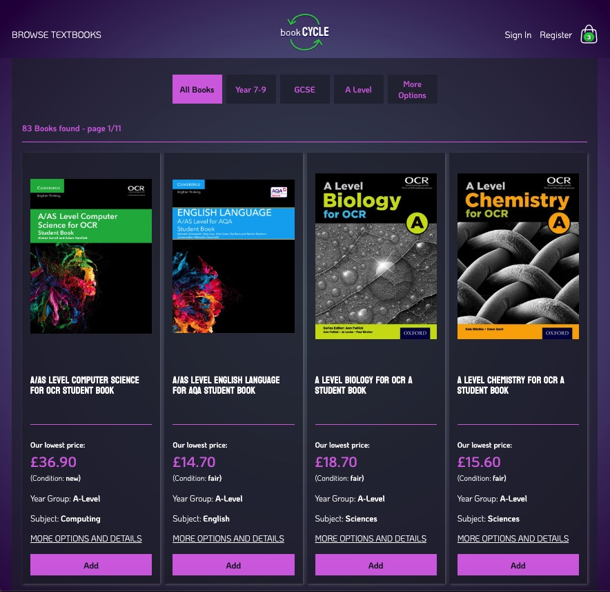
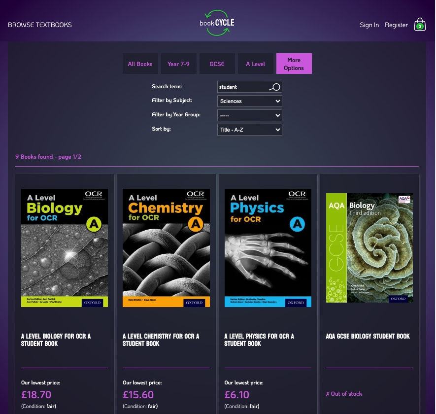

# Book-CYCLE

Book-CYCLE is a Full Stack Webshop Application designed to be used by secondary schools in the UK. The purpose of the site is to promote re-use of textbooks by students while generating income for the school. The webshop allows the school to list all the textbooks they recommend their students to buy in both new and used conditions - possibly asking students to donate their used books back to the school. 

Users can puchase listed textbooks using the STRIPE payment system, receiving confirmation emails about orders and shipping. School staff members can manage the book inventory and incoming orders.

The webshop has not been customized to a specific school, which could be done by including the school's logo, contact details, and possibly some additional design elements. Customisations would allow the webshop to be utilized by multiple schools.

The project is written in Django, a full-stack python framework, alongside HTML, CSS and JavaScript. The Stripe API is used for payments.

---
[View the live project here](https://book-cycle-f6aff45df7ba.herokuapp.com/inventory/books/)
---

> This project was created for [Code Institute](www.codeintitute.net)'s Web Development Course as the Fourth Milestone Project (MS4) - Full Stack E-Commerce App Development Project - for educational purposes.

Not for public use.
    
&copy; 2023 Szilvia Csernusne Berczes. All rights reserved.

---

# User Experience (UX)

## User Stories

---
## Wireframes

Wireframes were created in [Balsamiq](https://balsamiq.cloud/).   

  
  
 

---

## Colour Scheme

---

## Typography

---

## Imagery

---

# Database Schema

Database Schema in Lucid Charts:

https://lucid.app/lucidchart/8eb93ba8-43af-4939-9709-11dcc52da382/edit?viewport_loc=-452%2C117%2C2818%2C1215%2C0_0&invitationId=inv_a84acf43-e6e9-4d82-b0e2-672a16e53969

---

# Features

## Landing Page

The Landing page is minimalist with only few options on the top. The side menu opens from the left hand side, where users can search for textbooks in the store.

|Landing Page - light mode |Side Menu|Landing Page on mobile|
|:---:|:---:|:---:|
||||
|Landing Page - dark mode |||
||||
---

## Bookstore

### Filtering for books

The user has filtering and searching options from the side menu and additional options in the main bookstore page.
Clicking the `shop` button or one of the filtering options from the menu, we will be taken to the bookstore:
|Book store - light mode| Book store - dark mode |
|:---:|:---:|
|||
| <td colspan="2">Under the `More Options` button, complex searching, filtering and sorting can be carried out.
|||

---

## Shopping Process

We can start shopping right away, without the need for signing up.
We can add products directly from the bookstore's page or by visiting the individual book's page.
|Book Detail Page - light mode|Book Detail Page - dark mode|
|:---:|:---:|
|||

---

The shopping bag is available by clicking the shopping bag icon in the top right corner of the page.
|Shopping bag from side - light mode|Shopping bag from side - dark mode|
|:---:|:---:|
|||

---

If we would like to edit our shopping bag, we can do so by clicking the `Edit Bag` button. We can also select our shipping preference. 
|Shopping bag - light mode|Shopping bag - dark mode|
|:---:|:---:|
|||

---

If we choose to go back to the bookstore's page, we will see if we have a particular book in our shopping bag:

---

After clicking the `Checkout` button, we will be taken to the `Checkout Page`. If we chose to have the books delivered, we need to give detailed shipping information. Otherwise, only the `Country` and the `Postcode` are needed for the card payment.
|Checkout - light mode|Checkout - dark mode|
|:---:|:---:|
|||

---

`Stripe` provides a number of test cards that we can use for successful / failed payments. After a successful payment, we will receive a confirmation email about our order.
|Payment|Checkout Success Page & Email Confirmation|
|:---:|:---:|
| ||

---

## Authentication

I used the `django-allauth` package to implement authentication. The user can sign up with email address & password, as well their `Google account`.

### Register with email

Signing Up with email and password is straightforward. After the user clicks the link in the verification email, they will get signed in straight away.
|Register|Verify Email Page|Verify Email Message|
|:---:|:---:|:---:|
||||

---
### Sign in

For signing in at a later time, the user's email and password are required.

|Sign In Page|Sign In Success|
|:---:|:---:|
|||

---
### Registering/Signing in with a Google account

If a user sings in with their Google account, there is no need to verify the email address so the process is significantly faster. In the admin views below, I demonstrate how my user account and social account was created when I signed up with my Google account. In this case, no Password has been set.

|Google Sign In |User's account in Admin view|
|:---:|:---:|
|||

---

If a user already has an account and later decides to use their social account, their social account will be linked to their original account if the email address is the same.

---
### User Account

After successful registration, the user has access to their `order history` and `contact details`. 
|User Account Page light mode|User account Page dark mode|
|:---:|:---:|
|||

---

The user can `change` their password if they have one or `set` a new password if they don't. 
|Change Password |User with Social Account Only |Set Password|
|:---:|:---:|:---:|
||||

---

All users can use the `Forgot your password?` function.
|Password Reset | Password Reset Notification |
|:---:|:---:|
|||

---
### Deleting a User Account

The user can delete their account from the database, including their social account. Their order history will not be erased from the database, but no profile info will have been attached to them and will be inaccessible for the user.
I demonstrate how a user account is being deleted by deleting my social account I created earlier.
| Confirm Notification |Account Deleted Message |Accound Deleted Admin View|
|:---:|:---:|:---:|
||||

## Admin Functions

If the user's account is a `Staff Account`, they are taken to a different home page after signing in.
|Admin Home light mode|Side Menu|
|:---:|:---:|
|||
|Admin Home dark mode|Side Menu|
|||

---

## Inventory Management

Staff members can Add/Edit/Delete Books as well as manage the books' stock.

|Add New Book | Add New Book Success |
|:---:|:---:|
|||
|Manage Stock ||
|||
|Edit Book | Edit Book Success |
|||
|Delete Book | Delete Book Success |
|||

---

## Order Management

Staff members can monitor if there are new orders in the system. The orders which require shipping are listed separately from the ones that need to be collected.
|Orders require shipping | Orders for Collection |
|:---:|:---:|
|||

---

On the individual order's page, the staff member can use the shipping details for postage and register the tracking number.
|Order to Post (light mode) |Successful shipping|
|:---:|:---:|
|||

---

Similarly to the shipping, the staff member can register if an order has been collected.
|Order for Collection (dark mode) |Successful Collection|
|:---:|:---:|
|||

# SEO

* Lighthouse scores for Search Engine Optimasation are 100% throughout all pages.

* Furthermore, I created a `slug` for each book, based on their titles, that makes the book discoverable by search engines when someone is searching for the book's title. This approach will increase the site's traffic and increases potential revenue.

# Credits

## Programs used

* Image converter: https://cloudconvert.com/jpg-to-webp
* File converter (csv to json): https://csvjson.com/csv2json
* Favicon generator: https://realfavicongenerator.net/

## Learning Resources

* Hello Django walkthrough project by Code Institute
* Boutique Ado walkthrough project by Code Institute
* Django documentation

* Django Allauth documentation:
https://django-allauth.readthedocs.io/en/latest/account/configuration.html

* Django Crispy Forms documentation
https://django-crispy-forms.readthedocs.io/en/latest/index.html

* Webinar by Matt Rudge (Code Institute) https://www.youtube.com/watch?app=desktop&si=7Y-7qKnSZBRNzIxG&v=YH--VobIA8c&feature=youtu.be

## Helpful ideas

* Converting images to 'webp' format in python: https://www.webucator.com/tutorial/using-python-to-convert-images-to-webp/

* Colorizing automated django testing outputs: https://stackoverflow.com/questions/7815513/colorizing-the-output-of-django-tests

* Why django test files' imports can fail: https://stackoverflow.com/questions/51676483/importerror-failed-to-import-test-module

* How to use 'crispy_forms' without Bootstrap: https://levelup.gitconnected.com/how-to-make-your-django-forms-look-crispy-78a68000bc3f

* How to access request.POST data, sent using JS fetch request, in django:
https://stackoverflow.com/questions/61543829/django-taking-values-from-post-request-javascript-fetch-api

## Images

* Background image: https://unsplash.com/photos/OQSCtabGkSY - Photo by [Jessica Ruscello]("https://unsplash.com/@jruscello?utm_source=unsplash&utm_medium=referral&utm_content=creditCopyText") on [Unsplash]("https://unsplash.com/photos/OQSCtabGkSY?utm_source=unsplash&utm_medium=referral&utm_content=creditCopyText")

* Google logo: Vectors and icons by <a href="https://design.google/?ref=svgrepo.com" target="_blank">Google Design</a> in Logo License via <a href="https://www.svgrepo.com/" target="_blank">SVG Repo</a>

* Exemption from Copyright law: https://www.gov.uk/guidance/exceptions-to-copyright#non-commercial-research-and-private-study
  