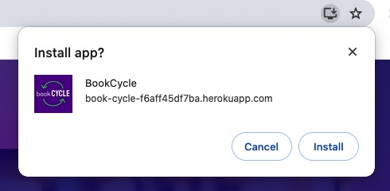
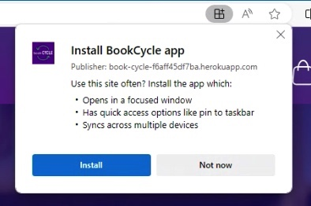
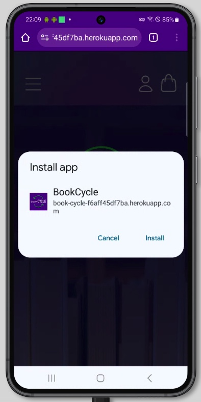
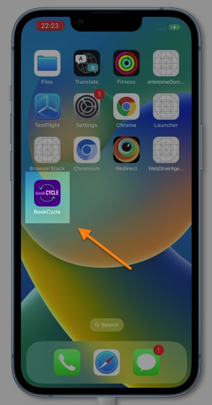
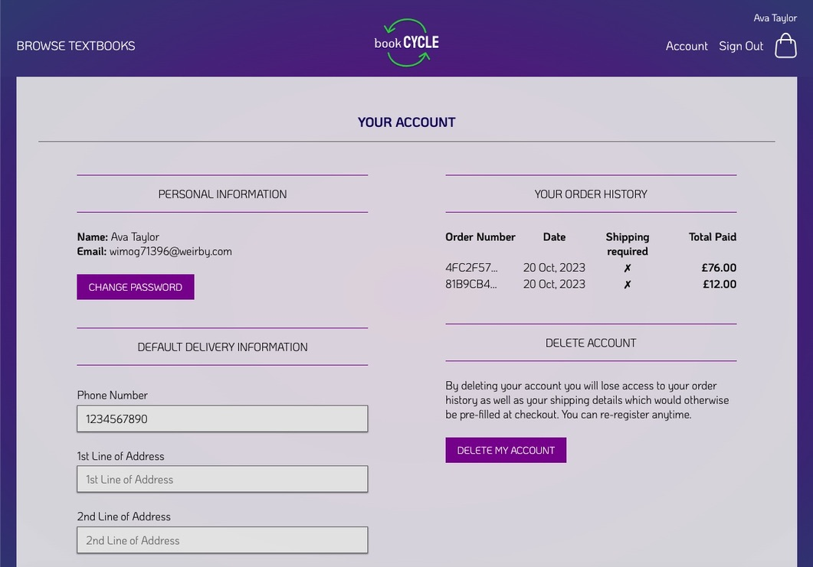
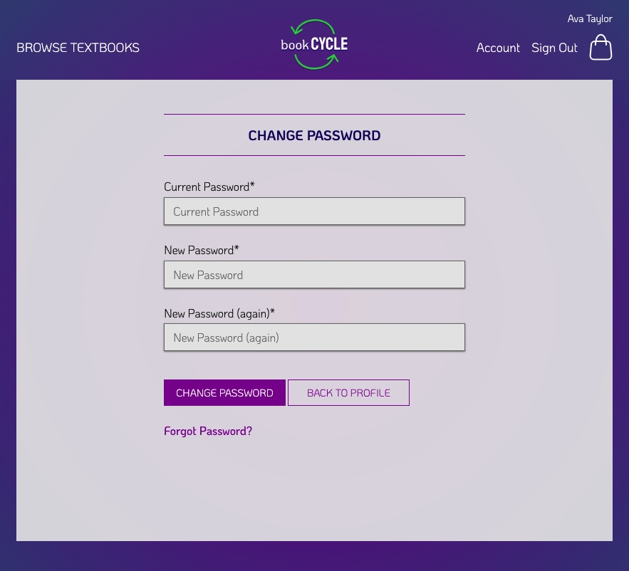
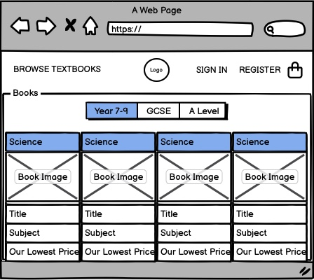
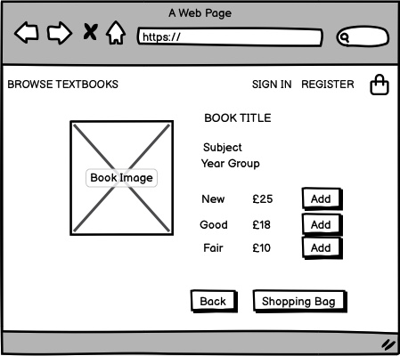
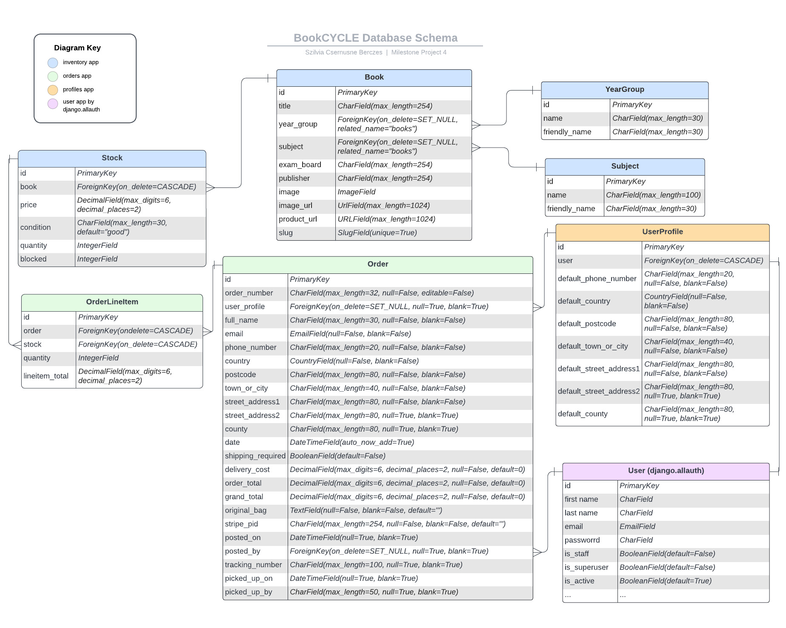

# Book-CYCLE

[](https://deepscan.io/dashboard#view=project&tid=23376&pid=26639&bid=850428)

Book-CYCLE is a Full Stack Webshop Application designed to be used by secondary schools in the UK. 

The project is written in `Django`, a full-stack Python framework, alongside `HTML`, `CSS`, `JavaScript` and the `Stripe API` for payments. It is a `Progressive Web App (PWA)`, allowing the user to install the app on both mobile and desktop devices.

The purpose of the application is to promote the re-use of textbooks by students while generating income for the school. The webshop allows the school to list all the textbooks they recommend their students to buy in both new and used conditions, possibly asking students to donate their used books back to the school.

Users can purchase listed textbooks using the STRIPE payment system and will receive confirmation emails about orders and shipping. School staff members can manage the book inventory and incoming orders.

The webshop has not been customized for a specific school, but it can be done by including the school's logo, contact details, and possibly some additional design elements. Customizations would allow the webshop to be utilized by multiple schools.


---
[View the live project here](https://book-cycle.szilvia-csernus.co.uk/)

---


> This project was created for [Code Institute](www.codeintitute.net)'s Web Development Course as the 4th Milestone Project (MS4) - Full Stack E-Commerce Web Application.

Not for public use.
    
&copy; 2023 Szilvia Csernusne Berczes.

---

# Features

## Installation

Book-CYCLE is a `Progressive Web App (PWA)`, allowing the user to install the app to the computer or mobile as a standalone app, providing a native-app-like experience. 

|Install - MacOS Chrome | Install - Windows Edge|
|:---:|:---:|
| | |
| Install - Android | Installed App - iPhone |
| | |


Cache-first strategy is implemented in the Service Worker, where all the static and image files are pre-cached and served from the cache whenever possible. This implementation greatly improves the loading speed of the application.

___

## Landing Page

The Landing page is minimalist with only a few options at the top. The side menu opens from the left-hand side, where users can search for textbooks in the store.

|Landing Page - light mode |Side Menu|Landing Page on mobile|
|:---:|:---:|:---:|
||||
|Landing Page - dark mode |||
||||
---

## Bookstore

### Filtering for books

Users have filtering and searching options from the side menu and additional options on the main bookstore page. Clicking the `shop` button or one of the filtering options from the menu will take us to the bookstore:
| Book store - light mode| Book store - dark mode |
|:---:|:---:|
|||


Under the `More Options` button, complex searching, filtering and sorting can be carried out.
| | |
|:---:|:---:|
|||

### Book details

The lowest price of the book, its condition (new, good or fair), if it is out of stock or 'in your bag' are all listed among the details of the book.
||||||
|:---:|:---:|:---:|:---:|:---:|
||||||


In order to speed up loading, pagination is used to avoid unnecessary data load.

---

## Shopping Process

You can start shopping right away, without the need for signing up. You can add products directly from the bookstore's page or by visiting the individual book's page. The number of books in your shopping bag will be shown in the top right corner.


Stock management allows displaying the available stock to the user and prevents purchasing out-of-stock items.


|Book Detail Page - light mode|Book Detail Page - dark mode|
|:---:|:---:|
|||

---

The shopping bag is available by clicking the shopping bag icon in the top right corner of the page.
|Shopping bag from side - light mode|Shopping bag from side - dark mode|
|:---:|:---:|
|||

---

If you would like to edit your shopping bag, you can do so by clicking the `Edit Bag` button. You can also select your shipping preference. 
|Shopping bag - light mode|Shopping bag - dark mode|
|:---:|:---:|
|||

---

If you choose to go back to the bookstore's page, you will see if you have a particular book in your shopping bag:


---

After clicking the `Checkout` button, you will be taken to the `Checkout Page`. If you chose to have the books delivered, you need to provide detailed shipping information. Otherwise, only the `Country` and the `Postcode` are needed for the card payment.

|Checkout - light mode|Checkout - dark mode|
|:---:|:---:|
|||

---

`Stripe` provides a number of test cards that you can use for successful or failed payments. After a successful payment, you will receive a confirmation email about your order.

|Payment|Checkout Success Page & Email Confirmation|
|:---:|:---:|
| ||

---

## Authentication

I used the `django-allauth` package to implement authentication. The user can sign up with email address & password, as well as with their `Google account`.

### Register with email

Signing up with an email and password is straightforward. After the user clicks the link in the verification email, they will be signed in straight away.
|Register|Verify Email Page|Verify Email Message|
|:---:|:---:|:---:|
||||

---
### Sign in

For signing in at a later time, the user's email and password are required.

|Sign In Page|Sign In Success|
|:---:|:---:|
|||

---
### Registering/Signing in with a Google account

If a user signs in with their Google account, there is no need to verify the email address, so the process is significantly faster. In the admin views below, I demonstrate how my user account and social account were created when I signed up with my Google account. In this case, no password has been set.

|Google Sign In |User's account in Admin view|
|:---:|:---:|
|||

---

If a user already has an account and later decides to use their social account, their social account will be linked to their original account if the email address is the same.

---
### User Account

After successful registration, the user has access to their `order history` and `contact details`.
| User Account Page - Light Mode | User Account Page - Dark Mode |
|:---:|:---:|
|||

---

The user can `change` their password if they have one or `set` a new password if they don't. 
|Change Password |User with Social Account Only |Set Password|
|:---:|:---:|:---:|
||||

---

All users can use the `Forgot password?` function.
|Password Reset | Password Reset Notification |
|:---:|:---:|
|||

---
### Deleting a User Account

The user can delete their account from the database, including their social account. Their order history will not be erased from the database, but no profile info will be attached to them and will be inaccessible for the user. I demonstrate how a user account is being deleted by deleting my social account I created earlier.
| Confirm Notification |Account Deleted Message |Accound Deleted Admin View|
|:---:|:---:|:---:|
||||

---
## Error pages

In case of an error, custom error pages would be shown to the user:
- `404 (not found) page` in case of an invalid URL was typed in.
- `403 (access denied) page` if there is an authentication issue.
- `400 (bad request)` if a request to the server was sent with incorrect data/structure.
- `500 (internal server error)` in case there is a problem with code execution or with the connection to the server.

| 404 - Not Found | 403 - Access Denied | 500 - Server Error |
|:---:|:---:|:---:|
||||
   
 ---


## Admin Functions

If the user's account is a `Staff Account`, they are taken to a different home page after signing in.
| Admin Home - Light Mode | Side Menu |
|:---:|:---:|
|||
| Admin Home - Dark Mode | Side Menu |
|||


---

## Inventory Management

Staff members can Add/Edit/Delete Books as well as manage the books' stock.

|Add New Book | Add New Book Success |
|:---:|:---:|
|||
|Manage Stock ||
|||
|Edit Book | Edit Book Success |
|||
|Delete Book | Delete Book Success |
|||

---

## Order Management

Staff members can monitor if there are new orders in the system. The orders that require shipping are listed separately from the ones that need to be collected.

|Orders require shipping | Orders for Collection |
|:---:|:---:|
|||

---

On the individual order's page, the staff member can use the shipping details for postage and register the tracking number.

| Order to Post - Light Mode | Successful Shipping |
|:---:|:---:|
|||

---

Similarly to the shipping, the staff member can register if an order has been collected.

| Order for Collection - Dark Mode | Successful Collection |
|:---:|:---:|
|||

---

# User Experience (UX)

## User Stories


---
## Wireframes

Wireframes were created in [Balsamiq](https://balsamiq.cloud/).   

  
  
 

---

## Colour Scheme

I personally chose the colors for this project, and the colour palette was created using [Figma](https://www.figma.com).

Light and dark modes are implemented for both customer and staff member pages, automatically adjusting to the computer's light/dark mode settings.

|Book store - light mode| Book store - dark mode |
|:---:|:---:|
|||
|Admin Console - light mode| Admin Console - dark mode |
|||

---

## Typography

I used two fonts, [Koulen](https://fonts.google.com/specimen/Koulen) and [KoHo](https://fonts.google.com/specimen/KoHo) from the [Google Fonts](https://fonts.google.com/) library. I selected these fonts because I felt that they complement each other, and their styles are fitting for the theme.

---

## Imagery

The [main image](https://unsplash.com/photos/OQSCtabGkSY) on the home page is credited to [Jessica Ruscello](https://unsplash.com/@jruscello?utm_source=unsplash&utm_medium=referral&utm_content=creditCopyText) and distributed by [Unsplash](https://unsplash.com/photos/OQSCtabGkSY?utm_source=unsplash&utm_medium=referral&utm_content=creditCopyText).

The logo and icons used in the project are my own drawings, with the exception of the [Google icon](https://design.google/?ref=svgrepo.com), which was downloaded from [SVG Repo](https://www.svgrepo.com/).

---

# Data

## Database Schema

The diagram illustrates a layout of the tables represented by my models in the database. The tables that were created by  django by default are omitted, as well as the `django-allauth` tables, with the exeption of the `User` table which is directly connected to my `User Profile` and `Order` tables.

The `Book` model contains most of the product details. To enable filtering by both `Year Group` and `Subject`, I chose to create separate models for each category. For each book instance, three `Stock` instances are created, representing different conditions: New, Good, and Fair. This one-to-many relationship allows me to manage prices, quantities, and reserved quantities based on the book's condition rather than the book itself. This structure also facilitates inventory management functions, such as adjusting stock levels, reserving stock while it's in a user's shopping bag, and reducing stock when a purchase is made.

When a user makes a purchase, the stock item is represented as an `Orderline Item` within the `Order` instance, which establishes a many-to-one relationship. The `Order` model contains all the necessary order details, including delivery, contact, and payment information. A `User Profile` is only attached to an order if the user has created an account and is signed in.

Upon user registration on the site and the creation of a `User` instance, a corresponding `User Profile` instance is created to store the user's default shipping and contact information. This feature enhances the checkout process for subsequent purchases.

Shopping bag is stored in django's built in `Session` model as a text field as was suggested in Code Institute's reference project (Boutique Ado) - not included in the diagram below.


I used [Lucid Charts](https://lucid.app/) to visualize the database schema.





[Schema Link (accessible for LucidChart users)](https://lucid.app/lucidchart/8eb93ba8-43af-4939-9709-11dcc52da382/edit?viewport_loc=-452%2C117%2C2818%2C1215%2C0_0&invitationId=inv_a84acf43-e6e9-4d82-b0e2-672a16e53969)

## Product data

I compiled a custom textbook list, converted it to JSON, and wrote custom scripts to create stock data, generating prices and stock amounts randomly. Finally, I used these files as `fixtures` to populate the database.

The book pictures and details were taken from the publishers' websites, and a link pointing to the original site is provided for all books.

---


# Accessibility

- Semantic HTML was used.
- Images have `alt` labels.
- Icons with inferred meanings are marked with `aria` labels.
- All colours were tested for contrast in Chrome's Dev Tools.
- For detailed Lighthouse scores for Accessibility, please refer to the [Testing document](TESTING.md#lighthouse-tests).


# SEO

- Lighthouse scores for Search Engine Optimization are 100% throughout all pages.
- `robots.txt` and `sitemap.xml` files are provided for use by search engines.
- I created a `slug` for each book, based on their titles, making the books discoverable by search engines when someone is searching for the book's title. This approach increases site traffic and potential revenue.

---

# Performance

The app is currently hosted in the most budget-friendly package of Heroku, with expected high-latency. To mitigate this, I used the `Cache First Strategy` as part of the `Progressive Web App (PWA)` implementation, which greatly improved serving the static and image files of the application. The lower performance in production is due to unavoidable elements, like Stripe's script needed for Fraud detection and the slow response time from the hosting providers. Purchasing more expensive hosting packages would greatly improve performance in production.


For the project's detailed Lighthouse scores, please refer to the [Testing document](TESTING.md#lighthouse-tests).

---

## Future Implementations

- Further functions for staff members: searching/filtering orders, handling returns and refunds.
- Adding further functionality to stock management, i.e. reports, analytics.
- Re-structure the database and functions to replace the Session-based shopping bag with a Shopping Bag model in order to have greater control over managing the user's shopping bag items.
- Implementing an API to calculate postage data and integrate package tracking.
- Re-creating the project in a Django REST + ReactJS architecture to improve UX.

---

# Technologies Used
  

## Languages Used
  

- Python: Using the Django framework and other plugins to develop the app.
- HTML: For page structure.
- CSS: For styling.
- JavaScript: Interactive frontend components and AJAX.
  

## Frameworks, Libraries and Packages
  

- [Django](https://www.djangoproject.com/): Full-stack python framework.
- [Stripe](https://stripe.com/gb): Used for processing payments securely.
- [django-allauth](https://allauth.org/): A Django package for authentication.
- [crispy-forms](https://django-crispy-forms.readthedocs.io/en/latest/): A Django package for form management.
- [Pillow](https://pypi.org/project/Pillow/): A Python imaging library for processing images.
- [Google Fonts](https://fonts.google.com/): For decorative text fonts.
- `boto3`: Used for configuration and Management of AWS.
- `coverage`: Measures lines of code tested.
- `dj-database-url`: Parses database URLs for Django.
- `django-countries`: Provides model fields for up-to-date country selection.
- `django-storages`: Creates custom storages for use with AWS.
- `gunicorn`: Web server to run on Heroku.
- `psycopg2`: Adapter for use with a PostgreSQL Database.


## Hosting platforms

- `Heroku`: For hosting the main codebase.
- `ElephantSQL`: For database hosting.
- `Amazon AWS S3`: For static/media file hosting. 


## Other Tools

- [Balsamiq](https://balsamiq.cloud/): To create wireframes.
- [Figma](https://www.figma.com/): To draw the logo and the icons, and to create the color palette.
- [RealFaviconGenerator](https://realfavicongenerator.net/svg-favicon/): To generate favicons.
- [Multi Device Website Mockup](https://techsini.com/multi-mockup/index.php): To create site visuals for responsive design.
- [VSCode](https://code.visualstudio.com/): For local development.
- [Git](https://git-scm.com/) & [Github](https://github.com/): For version control, safe storage, and deployment.
- [Google Dev Tools](https://developer.chrome.com/docs/devtools/): For testing and troubleshooting.
- [Lucid App](https://lucid.app): For database model visuals.
- [Random Key Generator](https://randomkeygen.com/): To generate a secret key.


---


# Testing

Please refer to [TESTING.md](TESTING.md) for detailed testing documentation.

---
    

# Local Development and Deployment

## Local Development

To develop this project locally in VSCode, the following steps are needed.    

0. Prerequisites: make sure python and psql are installed.
1. Set up a free account with STRIPE.
2. Clone this project into a new repository.
3. Create a new virtual environment in the project's parent folder with `python3 -m venv venv`.
4. While in the project's parent folder, activate the virtual environment with `source venv/bin/activate`.
5. Reload VSCode window. If the virtual environment creation and activation was successful, `(venv)` will appear in front of the prompt.
6. Install the required packages with `pip install -r requirements.txt`.
7. Create a `.gitignore` file, and place in the lines below.

    ```
    .vscode
    venv
    *.sqlite3
    *.pyc
    __pycache__
    .env
    ```

8. Create the `.env` file.
    
    ```
    SECRET_KEY=<your-secret-key>
    DEVELOPMENT=development
    STRIPE_PUBLIC_KEY=<your-stripe-public-key>
    STRIPE_SECRET_KEY=<your-stripe-secret-key>
    STRIPE_WH_SECRET=<your-stripe-webhook-secret>
    GOOGLE_CLIENT_ID=<your-google-client-id>
    GOOGLE_SECRET=<your-google-secret>
    DEBUG=anything
    ```
9. Run migrations with `python manage.py migrate`

10. Create a superuser for your database with `python manage.py createsuperuser`

11. Populate the database with data (in this order):
    1. `python manage.py loaddata yeargroup`
    2. `python manage.py loaddata subject`
    3. `python manage.py loaddata book`
    4. `python manage.py loaddata stock`

12. To back up data:
    1. `python manage.py dumpdata inventory.YearGroup > backup-yeargroup.json`
    2. `python manage.py dumpdata inventory.Subject > backup-subject.json`
    3. `python manage.py dumpdata inventory.Book > backup-book.json`
    4. `python manage.py dumpdata inventory.Stock > backup-stock.json`

    Alternatively, you can create just one backup file with `python manage.py dumpdata > backup.json`,
    these will include all data inc. user login history.

---

## Deployment

I originally deployed this project on `Heroku`, the database on `ElephantSQL` and the static/media files on `Amazon AWS S3`.

I took the following steps:

0. Prerequisites: An account with Heroku, ElephantSQL, Amazon AWS, Stripe, and an email server provider, such as Google.
1. Create a new ElephantSQL instance
2. Migrate the database
    * install `dj_database_url` and `psycopg2`,
    * in settings.py, add
    ```python
    import dj_database_url

    if 'DATABASE_URL' in os.environ:
        DATABASES = {
            'default': dj_database_url.parse(os.environ.get('DATABASE_URL', ''))
        }
        else:
            DATABASES = {
                'default': {
                    'ENGINE': 'django.db.backends.sqlite3',
                    'NAME': BASE_DIR / 'db.sqlite3',
                }
            }
    ```
    * temporarily, add `DATABASE_URL=<the-elephant-sql-database-url` to the `.env` file,
    * run `python manage.py showmigrations`, this will show if we are connected to the external database. No checks should show!
    * run `python manage.py migrate`
    * create a superuser for the database with `python manage.py createsuperuser`
    * populate the database with data (in this order):
        1. `python manage.py loaddata yeargroup`
        2. `python manage.py loaddata subject`
        3. `python manage.py loaddata book`
        4. `python manage.py loaddata stock`
    * confirm that the data is in the external database by running a table query in the ElephantSQL/Browser console.
    * remove the temporarily added `DATABASE_URL` from the `.env` file
    * to prevent 500 error on the deployed sign-in, edit the line temporary in the `settings.py`: ACCOUNT_EMAIL_VERIFICATION='none'

3. Create a new `Heroku App`.
    * In Settings/Config Vars add:

        ```
        DATABASE_URL
        SECRET_KEY
        STRIPE_PUBLIC_KEY
        STRIPE_SECRET_KEY
        STRIPE_WH_SECRET
        GOOGLE_CLIENT_ID
        GOOGLE_SECRET 
        EMAIL_HOST_PASS
        EMAIL_HOST_USER
        USE_AWS
        AWS_ACCESS_KEY_ID
        AWS_SECRET_ACCESS_KEY
        ```
    * install `gunicorn`
    * create the `Procfile`
    * to stop Heroku to collect static files, set `DISABLE_COLLECTSATIC` in the config file:
    ```
    heroku login
    heroku config:set DISABLE_COLLECTSTATIC=1 --app <heroku-app-name>
    ```
    * add the new Heroku app url to `ALLOWED_HOSTS` in `settings.py`
    * commit and push changes to Github.
    * set up heroku as a remote heroku repo for the project: `heroku git:remote -a <github-repo-name>`
    * deploy the project: `git push heroku main`
    * set up automatic deployment on Heroku: Deploy/GitHub, search for `<github-repo-name>`, `Connect` then `Enable Automatic Deploys`
3. Create a new `S3` bucket on `Amazon AWS` to serve static and media files
    * Create a new bucket
    * Enable static website hosting in Properties, this will give access point to be used from the internet.
    Select `Use this bucket to host a website`, keep the default values (they won't be used) and Save Changes.
    * Set up permissions by generating a CORS policy with the Policy Generator.
4. Set up a user group in `AWS IAM` in order to set up user permissions for the new bucket.
    * Create a user group: create a policy by importing `Amazon S3 Full Access`, set it up with the bucket's ARN, attach the policy to the group.
    * Create a user to go in the new group and create access key for this user
    * Add all AWS keys to the Heroku Config Vars.
5. Connect the django project to the new bucket
    * install `boto3` and `django-storages`, add `storages` to INSTALLED_APPS in `settings.py`
    * update the settings to use `AWS`:
    ```python
    if 'USE_AWS' in os.environ:
        # Cache control
        AWS_S3_OBJECT_PARAMETERS = {
            'Expires': 'Thu, 31 Dec 2099 20:00:00 GMT',
            'CacheControl': 'max-age=94608000',
            }

        AWS_STORAGE_BUCKET_NAME = 'book-cycle'
        AWS_S3_REGION_NAME = 'eu-west-2'
        AWS_ACCESS_KEY_ID = os.environ.get('AWS_ACCESS_KEY_ID')
        AWS_SECRET_ACCESS_KEY = os.environ.get('AWS_SECRET_ACCESS_KEY')
        AWS_S3_CUSTOM_DOMAIN = f'{AWS_STORAGE_BUCKET_NAME}.s3.amazonaws.com'

        # Static and media files
        STATICFILES_STORAGE = 'custom_storages.StaticStorage'
        STATICFILES_LOCATION = 'static'
        DEFAULT_FILE_STORAGE = 'custom_storages.MediaStorage'
        MEDIAFILES_LOCATION = 'media'

        # Override static and media URLs in production
        STATIC_URL = f'https://{AWS_S3_CUSTOM_DOMAIN}/{STATICFILES_LOCATION}/'
        MEDIA_URL = f'https://{AWS_S3_CUSTOM_DOMAIN}/{MEDIAFILES_LOCATION}/'
    ```
    * Remove `DISABLE_COLLECTSTATIC=1` variable from the Heroku config vars, because this time, we want django to collect the static files.
    * Create the `custom_storages.py` file to tell django to use `AWS S3` whenever someone runs collectstatic, and when any product image upload occurs.
    * Add and commit all changes to GitHub, which will trigger the automatic deployment to Heroku. Go to Heroku's Activity tab and view the build log to see if it was successful.
    * Go to `AWS S3`, the new bucket has a `static` folder in it.
    * For media files, add a new folder called `media` next to `static`. Click `Upload` and select all images to upload. Click `Upload` again.
6. Create/confirm the email address for the superuser.
    * Log in to the admin panel, go to `Email addresses`. Add a new email address if there is none.
    * Go to `Users`, select the only user, add the only email address then mark it as verified and primary.
    * In `settings.py`, change the `ACCOUNT_EMAIL_VERIFIED` back to `mandatory`.
    * Commit and push to GitHub.
7. Set up `STRIPE` for the deployed site.
    * Go to STRIPE `Developers` tag, grap the `API Keys` and add them to Heroku Config.
    * Create a new webhook endpoint with the deployed url, `/checkout/wh/` at the end. Select all events and `Add` them. Scroll down and `Add endppoint`.
    * Reveal the `Signing secret` and add it to the Heroku config vars.
    * Test that the webhook listeners are working by [sending test webhook events from the CLI](TESTING.md#testing-webhooks).


## Database migration from ElephantSQL to AWS RDS

I took the following steps.


1. I created an AWS RDS server instance which is running posgresql@16, have a public IP address and password authentication is enabled. 
For the VPC it resides in, has an internet gateway and the subnet's route table has this internet gateway as a network connection. In the instance's security group as an inbound rule, the port 5432 is open.

I created a new database with the help of `pgAdmin` in this AWS RDS server instance.


2. Migrated the database
    * installed the latest version of postgresql, version 16.
    * I used Code Institute's migration tool: https://github.com/Code-Institute-Org/postgres-migration-tool


##  App migration from Heroku to AWS EC2

1. I created a custom VPC in the Europe(London) Region with 3 public subnets in each availability zones. I added an internet
    gateway to the VPC and configured the route tables so the public subnets have this internet gateway as a network connection.

2. I added my environmental variables to Systems Manager's Parameter store and created an IAM role to allow access to these parameters by an EC2 instance.

3. Created a new `EC2 Launch Template` a for the deployment so that it can be re-used for re-deployement.
    * I selected the Amazon Linux image (AMI) and the smallest possible instance type.
    * I created a security group which allows inbound traffic on port 80 and attached this security group to the launch template.
    * Added the IAM role I created earlier.
    * In Advanced Settings, I populated the `user-data` field (bash script) which would run upon launch. It
        - installs python, git, and nginx
        - creates a virtual environment (useful for accessibility reasons)
        - installs all required packages
        - clones the github repo
        - retrieves metadata from the to-be-created instance to be used as an environmental variable.
        - creates the .env file and for this, it retrieves environmental variables from the parameter store.
        - migrates the database (runs when change is detected)
        - runs the 'collectstatic' function to move updated static and media files to S3
        - creates the nginx configuration and starts the nginx server
        - starts the gunicorn server.

4. Launced a new `EC2` instance with the launch template, into a selected subnet.

5. Created an internet facing, application load balancer in the same VPC as the EC2 instance is in.
    * Created a target group for the load balancer and registered the running EC2 instance to this target group.
    * Added a listener for port 80 (http) to redirect all traffic to port 443 (https)
    * Added a Secure listener for port 443 (https) and added the SSL certificate I earlier aquired for the domain name.
    * Added a HTTP Header rule, which forwards all traffic with the header of "book-cycle.szilvia-csernus.co.uk" to the target group.


    


# Credits

## Learning Resources

* Hello Django walkthrough project by Code Institute

* Boutique Ado walkthrough project by Code Institute - The Stripe implementation and the webhooks were adopted from this porject.

* Django documentation

* Django Allauth documentation:
https://django-allauth.readthedocs.io/en/latest/account/configuration.html

* Django Crispy Forms documentation
https://django-crispy-forms.readthedocs.io/en/latest/index.html

* Webinar by Matt Rudge (Code Institute) https://www.youtube.com/watch?app=desktop&si=7Y-7qKnSZBRNzIxG&v=YH--VobIA8c&feature=youtu.be

---

## Programs used

* Image converter: https://cloudconvert.com/jpg-to-webp
* File converter (csv to json): https://csvjson.com/csv2json
* Favicon generator: https://realfavicongenerator.net/

---

## Other helpful ideas/resources


* Converting images to 'webp' format in python: https://www.webucator.com/tutorial/using-python-to-convert-images-to-webp/

* Colorizing automated django testing outputs: https://stackoverflow.com/questions/7815513/colorizing-the-output-of-django-tests

* Why django test files' imports can fail: https://stackoverflow.com/questions/51676483/importerror-failed-to-import-test-module

* How to use 'crispy_forms' without Bootstrap: https://levelup.gitconnected.com/how-to-make-your-django-forms-look-crispy-78a68000bc3f

* How to access request.POST data, sent using JS fetch request, in django:
https://stackoverflow.com/questions/61543829/django-taking-values-from-post-request-javascript-fetch-api

* Privacy Notice Generator: https://termly.io


## Images

- **Background image:** [Unsplash](https://unsplash.com/photos/OQSCtabGkSY) - Photo by [Jessica Ruscello](https://unsplash.com/@jruscello?utm_source=unsplash&utm_medium=referral&utm_content=creditCopyText) on [Unsplash](https://unsplash.com/photos/OQSCtabGkSY?utm_source=unsplash&utm_medium=referral&utm_content=creditCopyText).
- **Google logo:** Vectors and icons by [Google Design](https://design.google/?ref=svgrepo.com) in Logo License via [SVG Repo](https://www.svgrepo.com/).
- The book images were taken from the publishers' websites. As this project was created for educational purposes only, it is exempt from copyright law. Nevertheless, I credited all products by providing a link to the original website. For further information, please refer to the UK government's website: [Exceptions to Copyright](https://www.gov.uk/guidance/exceptions-to-copyright#non-commercial-research-and-private-study).


##  Acknowledgements
  
I would like to thank the following contributors:

- My mentor, [Rory Patrick Sheridan](https://github.com/Ri-Dearg), and my college coordinator [Manuel Perez Romero](https://www.linkedin.com/in/manuel-perez-romero-460063176/) for providing useful feedback throughout the development and testing processes.
- My family, friends and fellow students, especially [Karolis Petrauskas](https://www.linkedin.com/in/kpetrauskas92/) and [Allen Gleeson](https://www.linkedin.com/in/allen-gleeson-a6263711a/) for taking the time to test the site and give suggestions for improvements.
- [Code Institute](www.codeintitute.net)'s Slack Community for continuous support.


##  Disclaimer
  

This project was created for [Code Institute](www.codeintitute.net)'s web application development course as the 4th Milestone Project for educational purposes.
    
Not for public use.
    
&copy; 2023 Szilvia Csernusne Berczes. All rights reserved. 