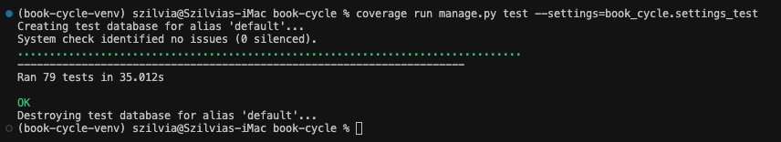
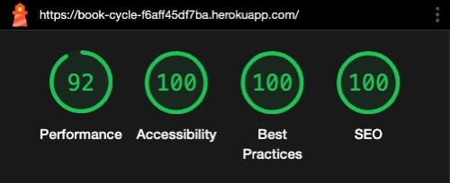
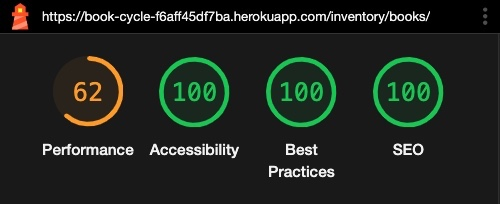
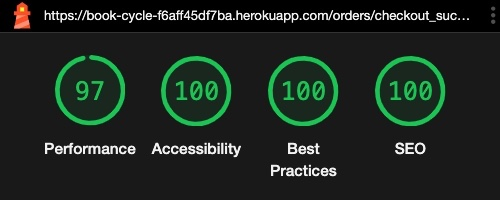
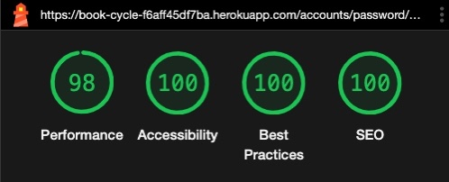
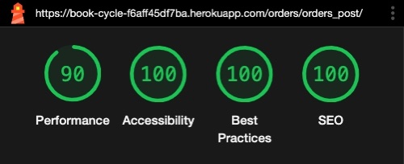
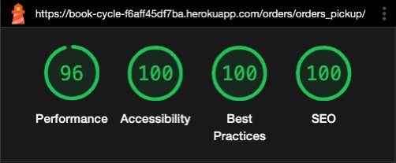

# TESTING - Book-Cycle project 
---

# Code Validation

## Python Validation

In VSCode, I used the `autopep8` and `Flake8` extensions to help keep my code free of linting issues.

The validation of the final versions of my files were carried out with CI's Python validator: https://pep8ci.herokuapp.com/

| CI Python Linter Result | Passed |
| :--- | :---: |
| [book_cycle/settings.py file CI Linter Result](testing_files/book_cycle-settings-py.jpeg) | &check; |
| [book_cycle/urls.py file CI Linter Result](testing_files/book_cycle-urls-py.jpeg) | &check; |  
| [book_cycle/wsgi.py file CI Linter Result](testing_files/book_cycle-wsgi-py.jpeg) | &check; |
| [home/urls.py file CI Linter Result](testing_files/home-urls-py.jpeg) | &check; |
| [home/views.py file CI Linter Result](testing_files/home-views-py.jpeg) | &check; |  
| [inventory/admin.py file CI Linter Result](testing_files/inventory-admin-py.jpeg) | &check; |
| [inventory/context.py file CI Linter Result](testing_files/inventory-context-py.jpeg) | &check; |  
| [inventory/forms.py file CI Linter Result](testing_files/inventory-forms-py.jpeg) | &check; |
| [inventory/models.py file CI Linter Result](testing_files/inventory-models-py.jpeg) | &check; |  
| [inventory/signals.py file CI Linter Result](testing_files/inventory-signals-py.jpeg) | &check; |
| [inventory/urls.py file CI Linter Result](testing_files/inventory-urls-py.jpeg) | &check; |  
| [inventory/views.py file CI Linter Result](testing_files/inventory-views-py.jpeg) | &check; |
| [inventory/widgets.py file CI Linter Result](testing_files/inventory-widgets-py.jpeg) | &check; |
| [orders/admin.py file CI Linter Result](testing_files/orders-admin-py.jpeg) | &check; |
| [orders/context.py file CI Linter Result](testing_files/orders-context-py.jpeg) | &check; |  
| [orders/forms.py file CI Linter Result](testing_files/orders-forms-py.jpeg) | &check; |
| [orders/models.py file CI Linter Result](testing_files/orders-models-py.jpeg) | &check; |  
| [orders/signals.py file CI Linter Result](testing_files/orders-signals-py.jpeg) | &check; |
| [orders/urls.py file CI Linter Result](testing_files/orders-urls-py.jpeg) | &check; |  
| [orders/views.py file CI Linter Result](testing_files/orders-views-py.jpeg) | &check; |
| [orders/webhook-handler.py file CI Linter Result](testing_files/orders-webhook-handler-py.jpeg) | &check; | 
| [orders/webhooks.py file CI Linter Result](testing_files/orders-webhooks-py.jpeg) | &check; |
| [profiles/forms.py file CI Linter Result](testing_files/profiles-forms-py.jpeg) | &check; |
| [profiles/models.py file CI Linter Result](testing_files/profiles-models-py.jpeg) | &check; |  
| [profiles/urls.py file CI Linter Result](testing_files/profiles-urls-py.jpeg) | &check; |  
| [profiles/views.py file CI Linter Result](testing_files/profiles-views-py.jpeg) | &check; |
| [shopping_bag/context.py file CI Linter Result](testing_files/shopping_bag-context-py.jpeg) | &check; |  
| [shopping_bag/urls.py file CI Linter Result](testing_files/shopping_bag-urls-py.jpeg) | &check; |  
| [shopping_bag/views.py file CI Linter Result](testing_files/shopping_bag-views-py.jpeg) | &check; |

---

## JavaScript Validations

Validator: https://jshint.com/

| JSHint Result | Passed | Warnings |
| :--- | :---: | :--- | 
| [bag.js file JSHint Result](testing_files/bag-js.jpeg)| &check; | ES11 features were flagged due to JSHint testing code against ES6.|
| [book_management.js file JSHint Result](testing_files/book_management-js.jpeg)| &check; | ES11 features were flagged due to JSHint testing code against ES6.|
| [books.js file JSHint Result](testing_files/books-js.jpeg)| &check; | |
| [checkout.js file JSHint Result](testing_files/checkout-js.jpeg)| &check; | |
| [menu.js file JSHint Result](testing_files/menu-js.jpeg)| &check; | |
| [modal.js file JSHint Result](testing_files/modal-js.jpeg)| &check; | ES11 features were flagged due to JSHint testing code against ES6.|
| [stripe-elements.js file JSHint Result](testing_files/stripe-elements-js.jpeg)| &check; | `Stripe` object is flagged as undefined due to it being imported in the template script.|
| [toast.js file JSHint Result](testing_files/toast-js.jpeg)| &check; | ES11 features were flagged due to JSHint testing code against ES6.|
    
---

## HTML Validations

Validator: https://validator.w3.org/

| W3 Result | Passed without errors |
| :--- | :---: |
| [`Home`](testing_files/w3-home.jpeg) | &check; |
| [`Books`](testing_files/w3-books.jpeg) | &check; |
| [`Book Detail`](testing_files/w3-book-detail.jpeg) | &check; |
| [`Add Book`](testing_files/w3-add-book.jpeg) | &check; |
| [`Edit Book`](testing_files/w3-edit-book.jpeg) | &check; |
| [`Shopping Bag`](testing_files/w3-shopping-bag.jpeg) | &check; |
| [`Checkout`](testing_files/w3-checkout.jpeg) | &check; |
| [`Checkout Success`](testing_files/w3-checkout-success.jpeg) | &check; |
| [`Orders to Post`](testing_files/w3-orders-post.jpeg) | &check; |
| [`Orders for Collection`](testing_files/w3-orders-pickup.jpeg) | &check; |
| [`Completed Orders`](testing_files/w3-orders-completed.jpeg) | &check; |
| [`Order Detail`](testing_files/w3-order.jpeg) | &check; |
| [`Login`](testing_files/w3-login.jpeg) | &check; |
| [`Profile`](testing_files/w3-home.jpeg) | &check; |
| [`Password Change`](testing_files/w3-password-change.jpeg) | &check; |
| [`Password Reset`](testing_files/w3-password-reset.jpeg) | &check; |

---

## CSS Validations

The css files were validated by direct input on https://validator.w3.org/nu/#textarea.
The results of the css file validations all look the same:

| File | Passed without errors |
| :--- | :---: |
| `base.css` | &check; |
| `account.css` | &check; |
| `checkout.css` | &check; |
| `home.css` | &check; |
| `inventory.css` | &check; |
| `loader.css` | &check; |
| `modal.css` | &check; |
| `orders.css` | &check; |
| `shopping_bag.css` | &check; |

---
# Testing User Stories

For User Stories' testing, please [refer to this document](testing_files/user-stories-testing.pdf)

---

# Automated Tests - Unit tests

I wrote 79 unit tests for my python files, [covering 89%](testing_files/coverage-report.pdf) of all statements.
Please see the results below:

---

[Click here for the detailed Coverage Report](testing_files/coverage-report.pdf)

---

To run the automated test cases on the development server, run:

`python manage.py test --settings=book_cycle.settings_test`

To check the 'Coverage' of all code tested, run:

`coverage run manage.py test --settings=book_cycle.settings_test`
`coverage report`

To view the report in the browser, run:

`coverage html`
`python -m http.server`

Follow the link and click on `htmlcov`

---

# Stripe implementation tests

## Testing Webhooks

Webhooks are available by Stripe for the developer to listen to events and take actions accordingly. I use this functionality to send a confirmation email about the order as well as creating the order itself if there was a network error between the payment and the regular order creation. To test that listening to webhooks have been correctly set up, we can use the `Stripe CLI` in our local development environment (VSCode).

After successful stripe-cli installation and configuration, we can run:

`stripe listen --forward-to localhost:8000/checkout/wh/` 

This gives back a webhook signing secret. This secret has to be copied in the `.env` file as `STRIPE_WH_SECRET`.

In this console, we will see the events happening. 

In a new console, we can trigger the events:

`stripe trigger payment_intent.payment_failed`

`stripe trigger payment_intent.succeeded`

On Stripe's Dashboard, we can also see the events triggered by the `Stripe CLI`:

## Stripe Dashboard

On the Stripe Dashboard, we can see detailed informaion about all the payment attempts and their outcomes, as well as meta information about the user and the purchase. This information is available for test payments, so we can test that our Stripe integration works as intended.

We can also monitor how our webhook handler responded to events.

---

 # Manual Testing

For detailed manual testing, please refer to this document:  

[Manual Test Cases](testing-images/manual-test-cases.pdf)

  
---

# Lighthouse tests

Performance, Accessibility, Best Practices and SEO tests were carried out with [Google Dev Tools](https://developer.chrome.com/docs/devtools/)' **Lighthouse** tool in `Incognito` mode.

Initial Response time by Heroku, Stripe, Amazon AWS, as well as Google Fonts were all flagged as causes of Performance issues, hence the lower scores for `Performance`. In the `Note` section, I only list additional issues.

| Page | Device  | Result in `light mode` | Result in `dark mode` | Note |
| :--: | :-----: | :------: | :------: |:--- |
| `Home` | mobile |  | | |
| `Home` | desktop |  | | |
| `Books` | mobile |  | | |
| `Books` | desktop |  | |  |
| `Book Detail` | mobile |  | | |
| `Book Detail` | desktop |  | |  |
| `Shopping Bag` | mobile |  | | |
| `Shopping Bag` | desktop |  | | |
| `Checkout` | mobile |  | | Stripe has a focusable   hidden element, which causes Accessibility issues. |
| `Checkout` | desktop |  | | Stripe has a focusable   hidden element, which causes Accessibility issues.  |
| `Checkout Success` | mobile |  | | |
| `Checkout Success` | desktop |  | | |
| `Profile` | mobile |  | ||
| `Profile` | desktop |  | ||
| `Login` | mobile |  | | |
| `Login` | desktop |  | | |
| `Register` | mobile |  | | |
| `Register` | desktop |  | |  |
| `Password Change, Set and Reset` | mobile |  | ||
| `Password Change, Set and Reset` | desktop |  | | |
| `Admin Home` | mobile |   |  ||
| `Admin Home` | desktop |   |  ||
| `Add New Book` | mobile |   |  ||
| `Add New Book` | desktop |   |  ||
| `Edit Book` | mobile |  | |
| `Edit Book` | desktop |  | |
| `Orders to Post` | mobile |   | | |
| `Orders to Post` | desktop |   |  ||
| `Orders for Collection` | mobile |   | | |
| `Orders for Collection` | desktop |   | | |
| `Completed Orders` | mobile |   | | |
| `Completed Orders` | desktop |   | | |
| `Order Details` | mobile |   | | |
| `Order Details` | desktop |   | | |

---

# Responsiveness Testing

Responsiveness was tested using [Google Dev Tools](https://developer.chrome.com/docs/devtools/)  
Browser & Version: Chrome Version 117.0.5938.149 (Official Build) (x86_64) on Desktop (macOS Catalina version 10.15.7)

A test considered as passed if the width of the page resizes to the given device's width.

| Device | iPhone SE | iPhone XR | iPhone 12 Pro | Pixel 5 | Samsung Galaxy S8+ | Samsung Galaxy S20 Ultra | iPad Air | iPad Mini | Surface Pro 7 | Samsung Galaxy A51/71 | Nest Hub | Nest Hub Max |
| :--- | :---: | :---: | :---: | :---: | :---: | :---: | :---: | :---: | :---: | :---: | :---: | :---: |
| `Home` | &check; | &check; | &check; | &check; | &check; | &check; | &check; | &check; | &check; | &check; | &check; | &check; |
| `Books` | &check; | &check; | &check; | &check; | &check; | &check; | &check; | &check; | &check; | &check; | &check; | &check; |
| `Book Detail` | &check; | &check; | &check; | &check; | &check; | &check; | &check; | &check; | &check; | &check; | &check; | &check; |
| `Shopping Bag` | &check; | &check; | &check; | &check; | &check; | &check; | &check; | &check; | &check; | &check; | &check; | &check; |
| `Checkout` |&check; | &check; | &check; | &check; | &check; | &check; | &check; | &check; | &check; | &check; | &check; | &check; |
| `Checkout Success` | &check; | &check; | &check; | &check; | &check; | &check; | &check; | &check; | &check; | &check; | &check; | &check; |
| `Profile` | &check; | &check; | &check; | &check; | &check; | &check; | &check; | &check; | &check; | &check; | &check; | &check; |
| `Login` | &check; | &check; | &check; | &check; | &check; | &check; | &check; | &check; | &check; | &check; | &check; | &check; |
| `Register` | &check; | &check; | &check; | &check; | &check; | &check; | &check; | &check; | &check; | &check; | &check; | &check; |
| `Password Change` | &check; | &check; | &check; | &check; | &check; | &check; | &check; | &check; | &check; | &check; | &check; | &check; |
| `Admin Home` | &check; | &check; | &check; | &check; | &check; | &check; | &check; | &check; | &check; | &check; | &check; | &check; |
| `Edit Book` | &check; | &check; | &check; | &check; | &check; | &check; | &check; | &check; | &check; | &check; | &check; | &check; |
| `Orders to Post` | &check; | &check; | &check; | &check; | &check; | &check; | &check; | &check; | &check; | &check; | &check; | &check; |
| `Orders for Collection` | &check; | &check; | &check; | &check; | &check; | &check; | &check; | &check; | &check; | &check; | &check; | &check; |
| `Completed Orders` | &check; | &check; | &check; | &check; | &check; | &check; | &check; | &check; | &check; | &check; | &check; | &check; |
| `Order Detail` | &check; | &check; | &check; | &check; | &check; | &check; | &check; | &check; | &check; | &check; | &check; | &check; |

---

# Resolved bugs - discovered during Testing

* On the `Edit Book` page, if the user checked the 'Remove image' box and at the same time selected a new image,
the form was not accepted as valid. To resolve this, I wrote a JS script which makes sure that only one of these
fields can be set.
* The image upload field on both `Add Book` and `Edit Book` pages allowed more file formats than django's ImageField
accepted as valid. If user attempted to upload an invalid image, it resulted in an invalid form error. To improve user experience, I restricted the file formats in the `custom_clerable_file_input.html` file, so the user can not accidentally
select invalid file formats.
* While testing the inventory functionalities I noticed that the specified stock data remained reserved in the inventory after session (shopping bag) data got cleared. This was an issue because the reserved items were not available other customers to purchase. To rectify this, I wrote a signal to un-reserve the stock after a session is destroyed.
* Code validation revealed that a number of semicolons were missing from my JavaScript files. - Rectified.
* Lighthouse testing revealed a number of small issues: Some buttons' contrast ratio needed to be increased, a link needed a 'more descriptive text', some links needed more space around them, the width and height of an image was referenced incorrectly. - All rectified.
---

# Remaining Bugs

* If the user signs up with a social account and later decides to set up a password, after they did so, the `Set Password` function redirects the user to the `Change Password` page, despite setting the password successfully. As to my knowledge, configuring this url for `Set Password` is not possible in this version (0.56.1) of `django-allauth` - a possible solution could be a custom view that extends the set password view.

* Stripe does not allow setting the card element's colour dynamically to allow changing to dark mode, it enforces `light-theme-only` as an `!important` inline styling that can not be changed. In order to display the card's number in both light and dark mode, I chose a grey colour that is readable with both backgrounds. This makes the card number's colour different from all other form element's colour.

* Chrome DevTool console displays warnings about Stripe's Same-Site Cookies. That is because Stripe recommends to import its script onto every page of the webshop to help Stripe's Fraud Detection Scheme:
https://stripe.com/docs/disputes/prevention/advanced-fraud-detection To resolve the same cookie issue, Stripe is working on the solution:
https://support.stripe.com/questions/chrome-80-samesite-cookie-change?locale=en-GB

